<h1 align="center"> 🍲 Ektu Jhal: A Modern Recipe App</h1>
<p align="center"><em>A spicy little React Native app that brings handpicked recipes to your fingertips.</em></p>

<h2>📖 Table of Contents</h2>
<ul>
    <li><a href="#overview">Overview</a></li>
    <li><a href="#features">Features</a></li>
    <li><a href="#screenshots">Screenshots</a></li>
    <li><a href="#installation">Installation</a></li>
    <li><a href="#contributing">Contributing</a></li>
    <li><a href="#acknowledgments">Acknowledgments</a></li>
    <li><a href="#contact">Contact</a></li>
</ul>

<h2 id="overview">🔍 Overview</h2>
<p>
    <strong>Ektu Jhal</strong> is a recipe app built with <strong>React Native</strong> and <strong>Expo</strong>. It features beautifully displayed recipes, category-based filtering, a "featured recipe" section, and a slick minimal UI designed for foodies who love flavorful dishes.
</p>

<h2 id="features">✨ Features</h2>
<ul>
    <li>📱 Built with React Native and optimized for both Android & iOS.</li>
    <li>🍛 View delicious meals with cook time, region, and servings info.</li>
    <li>📂 Browse by categories with swipeable filters.</li>
    <li>⭐ Featured recipe section on top.</li>
    <li>🔄 Pull-to-refresh for real-time updates.</li>
    <li>⚡ Uses MealDB API for fresh and dynamic content.</li>
    <li>🖼️ Custom designed logo and theme for a spicy brand presence.</li>
    <h2 id="backend">🛠 Backend (Hosted on Render)</h2>
<p>
    The backend for <strong>Ektu Jhal</strong> is hosted on <a href="https://render.com" target="_blank">Render</a>. It is used to store the favourite recipe in Database.
</p>
<p>
    Base API URL: <code>https://your-api-name.onrender.com</code><br/>
    Ensure this URL is stored in a <code>.env</code> file as <code>API_BASE_URL</code>.
</p>

</ul>

<h2 id="screenshots">📸 Screenshots</h2>

<h4>Home Screen</h4>
<table>
  <tr>
    <td>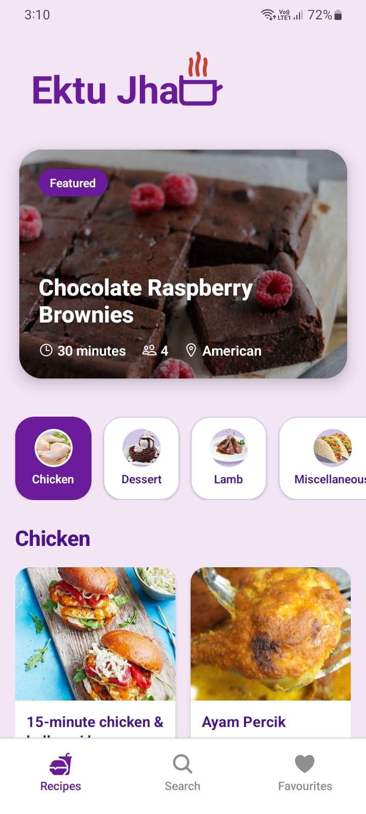</td>
    <td>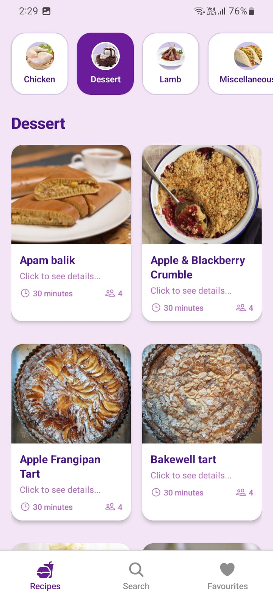</td>
  </tr>
</table>

<h4>Authentication Screen</h4>
<table>
  <tr>
    <td>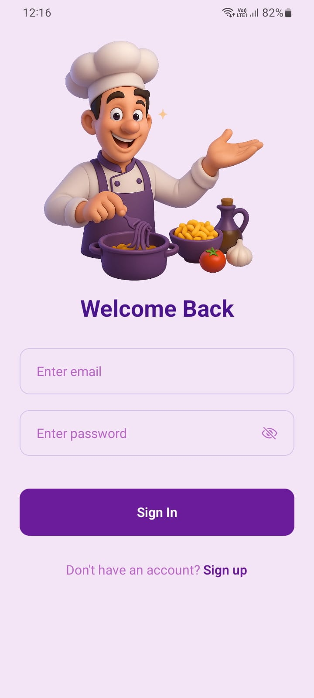</td>
    <td>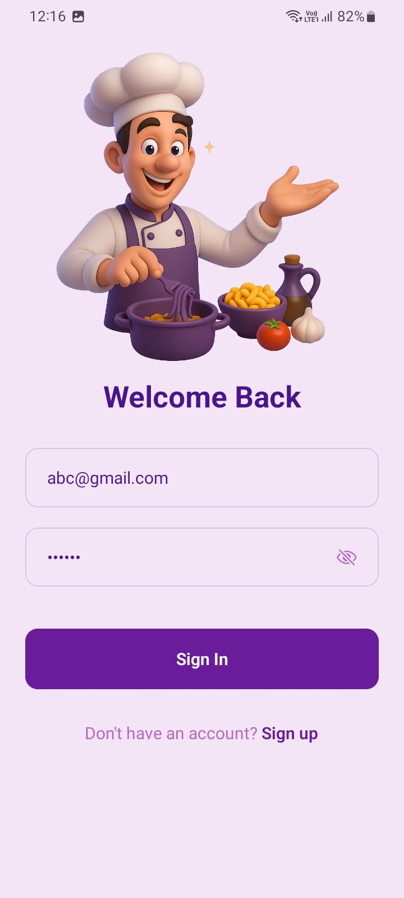</td>
    <td>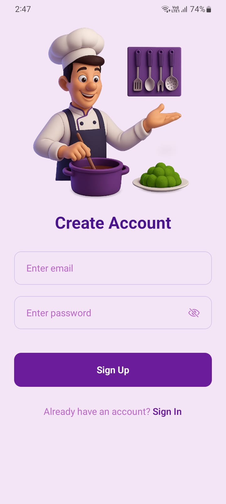</td>
    <td>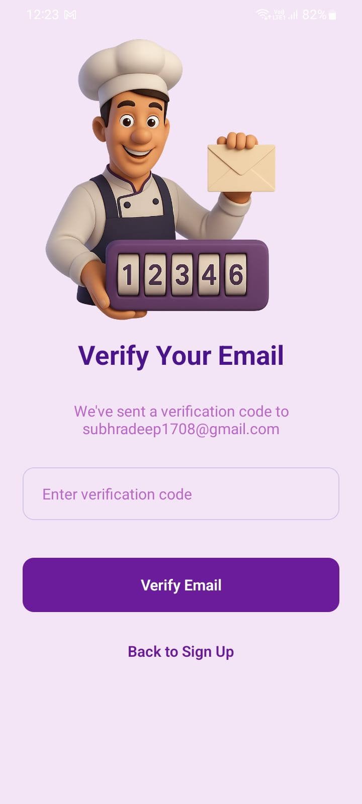</td>
  </tr>
</table>

<h4>Category Filter</h4>


<h4>Search Recipe Screen</h4>
<table>
  <tr>
    <td>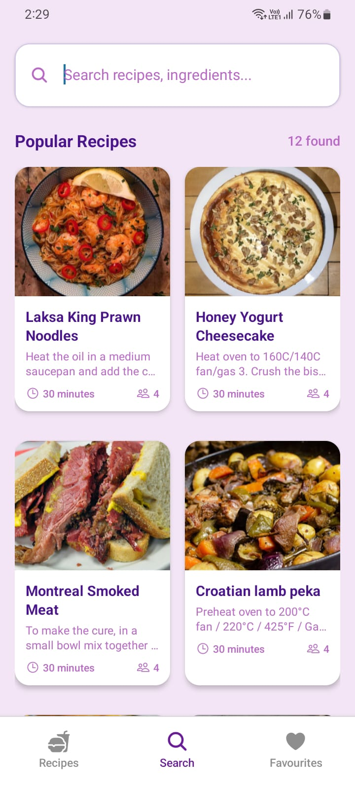</td>
    <td>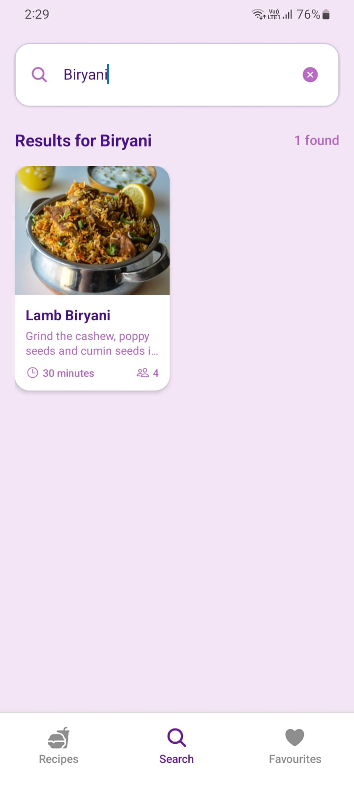</td>
  </tr>
</table>
<h4>Recipe Details Screen</h4>
<table>
  <tr>
    <td>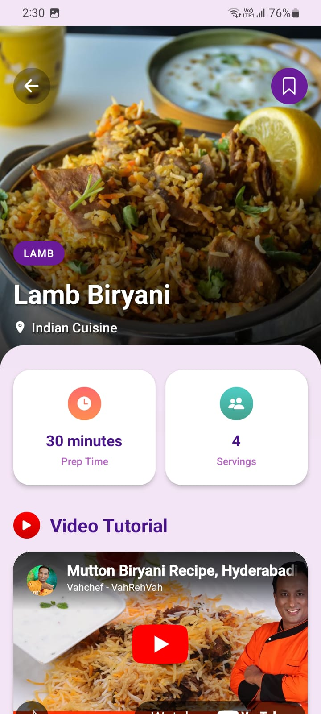</td>
    <td>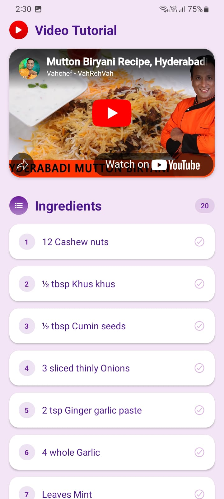</td>
    <td>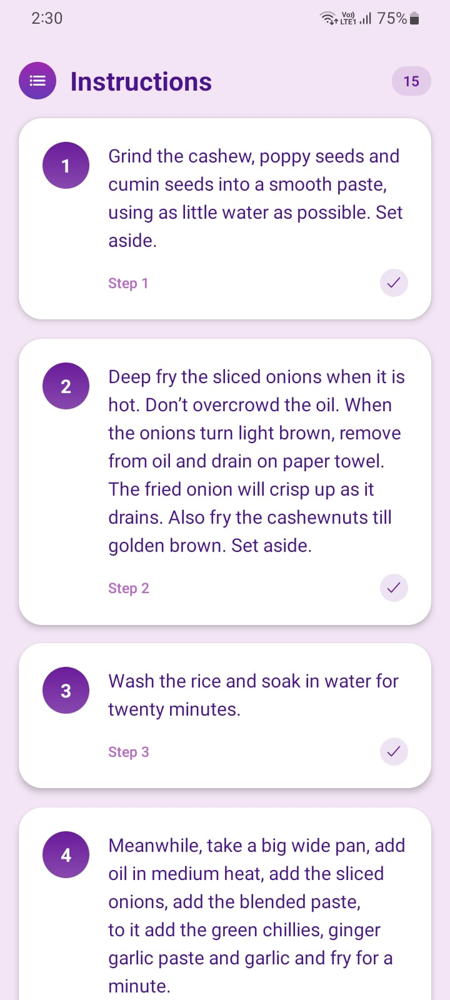</td>
  </tr>
</table>


<h4>Favourites Screen</h4>
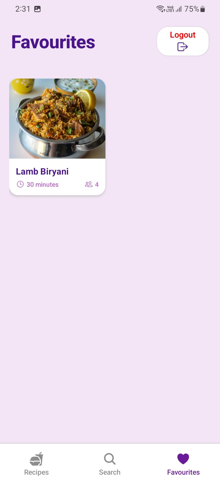

<h2 id="installation">⚙ Installation</h2>

```bash
# Clone the repository
git clone https://github.com/Subhradeep1708/Expo-Recepie-App

cd Ektu-Jhal/mobile

# Install dependencies
npm install

# Start the app
npx expo start
```

<h2 id="contributing">👥 Contributing</h2> <p>Contributions are welcome! Follow these steps:</p> <ol> <li>Fork the repository.</li> <li>Create a feature branch (<code>git checkout -b feature/AmazingFeature</code>).</li> <li>Commit changes (<code>git commit -m 'Add AmazingFeature'</code>).</li> <li>Push to the branch (<code>git push origin feature/AmazingFeature</code>).</li> <li>Open a Pull Request.</li> </ol> <h2 id="acknowledgments">🙏 Acknowledgments</h2> <ul> <li>MealDB API for recipe data</li> <li>React Native, Expo</li> <li>Ionicons and Expo Image for UI elements</li> </ul> <h2 id="contact">📞 Contact</h2> <p> Project Maintainer: <a href="mailto:subhradeep1708@gmail.com">subhradeep1708@gmail.com</a><br> GitHub: <a href="https://github.com/Subhradeep1708">@Subhradeep1708</a> </p> 